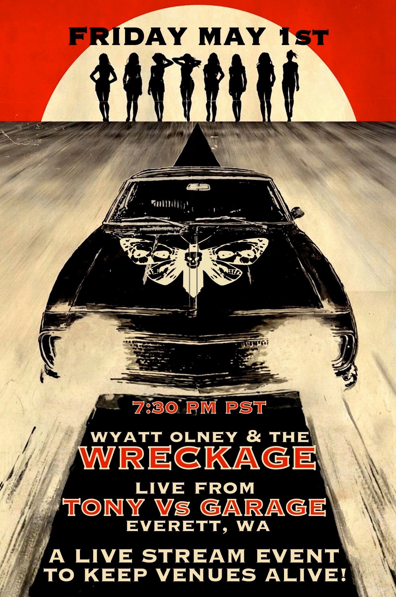

import ShowsV2 from '../src/components/shows.js'
import ReleasesV2 from '../src/components/releases.js'
import Subscribe from '../src/components/mailchimp/subscribe.js'
import LandingSectionTitle from '../src/components/landing-section-title.js'
import BannerV2 from '../src/components/banner.js'

<BannerV2 />

<Container>

<!-- Landing page content

  Welcome to Seattle

-->

<!-- Call to action

  <a class="gtm-button" href="#" rel="external">
    Learn More
  </a>

-->

<iframe src="https://player.twitch.tv/?channel=tonyvsgarage" frameborder="0" allowfullscreen="true" scrolling="no" height="500" width="100%"></iframe><a href="https://www.twitch.tv/tonyvsgarage?tt_content=text_link&tt_medium=live_embed" style="padding:2px 0px 4px; display:block; width:345px; font-weight:normal; font-size:10px; text-decoration:underline;">Watch live video from TonyVsGarage on www.twitch.tv</a>

<ShowsV2 shows={props.shows} locale="en-US" />

  

<ReleasesV2 releases={props.releases} locale="en-US" />

<!-- Music Videos -->

  <LandingSectionTitle>Music Videos</LandingSectionTitle>

<!-- Silver Bullet -->
<Youtube url="https://www.youtube.com/watch?v=_nNYBsqWMV0" />

<!-- Welcome to Seattle -->
<Youtube url="https://www.youtube.com/watch?v=G4qpFCWK6k8" />

<!-- Off the Wagon -->
<Youtube url="https://www.youtube.com/watch?v=wti7xEgNxeA" />

<!-- Embed Youtube video -->
<!-- <Youtube url="https://www.youtube.com/watch?v=GBUCmMxmup0" /> -->

<!-- Embed Spotify and Soundcloud tracks -->
<!-- https://open.spotify.com/track/4uLU6hMCjMI75M1A2tKUQC -->

<!-- Bio -->

  <LandingSectionTitle>{`Biography`}</LandingSectionTitle>

Wyatt Olney & The Wreckage is a hard rock quartet from Seattle, WA.  Formed in 2015, the group quickly rose to prominence in the Pacific Northwest and surrounding territories after the release of the debut album __Dark Futures__ in 2016.  Over the course of 2016, the band went from playing basements to performing to a sold-out Showbox Market (1200 capacity) alongside Seattle rock giants Windowpane and Van Eps.

The 2017 release of the anthemic sophomore album __Welcome To Seattle__ was met with widespread acclaim and led to regular rotation on local radio stations and headlining performances at 99.9 KISW's Red Festival and several other major music festivals.

The band works closely with charitable organizations - specifically those involved with funding research for Multiple Sclerosis.  In 2018, Wyatt Olney & The Wreckage partnered with 99.9 KISW to launch F*MS! - an annual benefit showcase at the legendary Seattle nightclub The Crocodile to raise funding for MS research.

In late 2019, the band announced the upcoming release of their third album __Silver Bullet__ - due for worldwide release in __June 2020__, with an accompanying tour and several summer festival performances to follow.

<!-- Booking -->

  <LandingSectionTitle>{`Booking Info`}</LandingSectionTitle>

  <figure>
    
  </figure>

  

  For booking inquiries in the United States and Canada, please email <a href="mailto:wyattolney@gmail.com">here</a>.
   
  For international booking inquiries, please email <a href="mailto:wyattolneymusic@gmail.com">here</a>.
  

  <Subscribe />
  

</Container>
